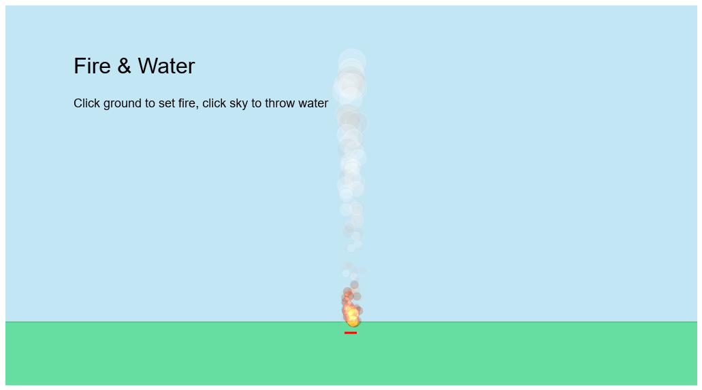

# Fire & Water

- Fire
- Water

## Interaction

- Simplificar los elementos a un punto de referencia con un area de influencia x,y,r
- Los elementos interaccionan dentro de su area de influencia
- El agua reduce la vida del fuego
